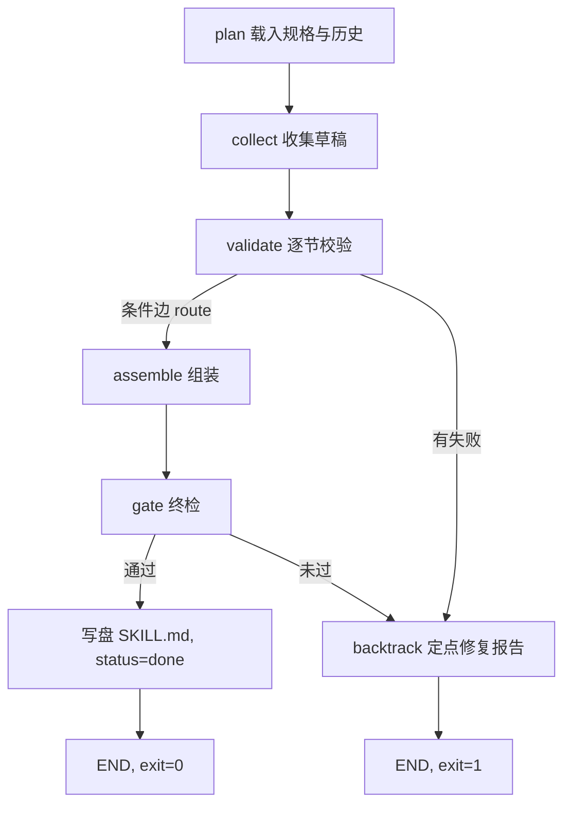

# value-lens 装配管线设计说明

> LangGraph + 回溯机制，解决「长文一次生成总是失败/丢内容」问题。
> 适用范围：任何"分节长文档"的可靠产出——SKILL.md、README、报告、章程皆可。
> 实测环境：Windows 11 / Python 3.13 / langgraph（`pip install langgraph`），单文件零外部服务。

## 1. 问题与方案概述

**问题**：让 LLM 一次性生成 5000+ 字的结构化文档，失败模式高度稳定——丢章节、留占位符、篇幅失衡；整篇重写成本高且换一批新错误。

**方案**：把"一次生成"改成"分节生产 + 流水线验收"：

```
10 个章节草稿（drafts/s01..s10.md，可分多次、多个会话写）
        ↓
LangGraph 状态机逐节校验（长度 / 必需元素 / 禁占位符）
        ↓ 全绿                     ↓ 有失败
   组装 SKILL.md              回溯节点：只对坏节生成定点修复报告
        ↓ 终检 gate                （作者修坏节，好节不动）
   写盘，任务完成              记账 state.json（每节尝试次数，预算 3 次）
```

核心思想一句话：**把失败局部化**。第 2 轮 8 节通过、2 节缺元素时，回溯只揪出那 2 节、精确到"缺什么"，8 个好节原封不动——修复成本从 O(全文) 降到 O(坏节)。

## 2. 图结构



- `validate → assemble / backtrack` 是**条件边**（`add_conditional_edges` + `route` 函数，按 `failures` 是否为空路由）。
- `backtrack → END`（设计取舍见 §5）：返回控制权给作者，而非自动重试。
- `gate` 失败时内部直接调用回溯函数（单级兜底，不再成环），防止组装产物异常时静默写盘。
- `recursion_limit=25`：图深度固定且浅，该上限只为兜底防死循环。

## 3. 状态定义

```python
class St(TypedDict):
    round: int          # 轮次（当前固定 1，跨轮状态在 state.json）
    drafts: dict        # sid -> 草稿全文（缺失节记 ""）
    failures: list      # [{sid, title, missing:[...]}]——回溯的唯一定位依据
    fix_report: dict    # 定点修复报告（失败节/尝试次数/预算告警/作者指令）
    assembled: str      # 组装产物（仅全绿后填充）
    status: str         # init / needs_fixes / gate_failed / done
```

跨次运行的状态不在图状态里，而在 `state.json`：

```json
{
  "attempts": {"s01": 1, "s05": 2, ...},   // 每节累计失败次数（复核预算账本）
  "history": [ {"t": "...", "result": "backtrack|done", "failed": ["s05"]} ]
}
```

`python pipeline.py --reset` 清账重来。

## 4. 六个节点

| 节点 | 职责 | 关键实现 |
|---|---|---|
| plan | 清空本轮临时状态，载入分节规格 | 规格硬编码在 `SECTIONS`（见 §6） |
| collect | 读 `drafts/sXX.md` | 文件缺失/为空 → 记 failure，**不抛异常** |
| validate | 三类检查 | 跳过 collect 已失败的节，避免重复报错 |
| assemble | 按 SECTIONS 顺序拼装 | **保留现有 SKILL.md 的 frontmatter**（split 提取），正文固定为 `## N. 标题` 结构 |
| gate | 终检四项 | `---` 配对、`name: value-lens` 存在、全文禁占位符、`\n## ` 计数 == 章节数 |
| backtrack | 回溯 | attempts 计数、写 state.json、打印坏节及具体缺失项、生成作者指令 |

**退出码协议**：`exit 0` = done（SKILL.md 已更新）；`exit 1` = needs_fixes（修复报告已就绪）。脚本可直接进 CI 或被 agent 当作可重试命令。

## 5. 回溯机制（本设计的核心）

三条原则：

1. **失败局部化**：failures 数组精确到 `sid + 具体缺失项`（如"缺少必需元素: 账本"）。作者（人或 LLM）拿到的不是"重来"，而是可执行的最小修复指令：*只修列出的节，修完重跑；未列节勿动*。
2. **预算告警而非无限重试**：每节累计失败达 `MAX_ATTEMPTS=3` 次时，报告升级为"需换方法而非重试"——连续三次过不了同一道校验，说明是规格或理解问题，重试第 4 次没有信息增量。
3. **回溯即终结本轮**：`backtrack → END`，不在图内自动重写。理由：a) 规格校验是确定性判定，图内盲重试要么费钱要么反复撞同一堵墙；b) 修复动作（作者改草稿）发生在管线外部；c) 每一轮运行都被 state.json 记账，形成"哪节最难产"的长期数据。

实测记录（本 skill 开发过程即验收过程）：

| 轮次 | 输入状态 | 管线行为 |
|---|---|---|
| 1 | 10 节全空 | 10 节全失败 → 修复报告 + 记账，exit 1，无崩溃无胡编 |
| 2 | 8 节就绪，s05/s08 缺关键词 | 只报 s05/s08（"缺少必需元素: 账本"），好节不动 |
| 3 | 定点修复 2 处后 | 全绿 → 组装 → gate 通过 → 写盘 6145 字符，exit 0 |

## 6. 校验器设计：SECTIONS 即最小可执行规格

```python
SECTIONS = [
    ("s01", "定位与三折叠", 200, ["折叠", "对谁", "价格≠价值"]),
    ("s02", "七层价值栈", 260, ["效用", "稀缺", "期权", ...]),
    ...
]
# 每项: (章节id, 标题, 最小字符数, 必需元素关键词列表)
# 全局禁用: BANNED = [r"\[placeholder", r"TODO", r"待补"]（大小写不敏感）
```

- **关键词校验是故意选的**：不追语义正确（那需要另一个 LLM，引入新幻觉源），只追**结构性存在**。核心概念必须出现、篇幅必须达标、占位符必须清零——这三件事是"失败"的充分信号，且判定 100% 确定、零成本、可复现。
- 必需元素同时充当**防漂移锚**：长文改稿时最容易丢的就是关键概念（实测 s05 改稿时把"六账合称处置账本"写丢，被校验器当场抓住）。
- 阈值是下限不是目标：minlen 取"低于此值必是偷工"的粒度，上不封顶。

## 7. 已知局限与扩展方向

| 局限 | 说明 | 扩展钩子 |
|---|---|---|
| SECTIONS 内置 | 换 skill 要改代码 | 把规格抽成 `sections.json`（计划内） |
| 作者=人 | backtrack 后需人工改草稿 | 可接 LLM 节点：把 failure 清单喂回模型定点重写坏节（回溯图变成自动闭环，预算告警仍兜底） |
| 单文档 | 一次只装配一个 SKILL.md | 泛化为 doc-type 配置，多 skill 共用一条产线 |
| gate 兜底单级 | gate 失败直接进回溯 | 如需严格性可改成条件边回 assemble 前置检查 |
| Windows 控制台 | GBK 终端打印 ▶✗ 会乱码 | 纯显示问题，文件与 state 均为 UTF-8，不影响结果 |

## 8. 复用指南（v2：给下一个文档上产线）

1. 目标目录建 `sections.json`（name/h1/sections:[id,title,minlen,requires]）与空 `drafts/`；
2. 若需保留 frontmatter，先手写进目标 SKILL.md（管线只保留不生成）；
3. 从既有文档拆节时，先确认 H1 后是否有 intro 段，**映射按真实结构断言**；
4. 跑 `python tools/doc_pipeline.py <doc_dir>` 拿修复报告 → 逐节写草稿 → 重跑至全绿。
5. 经验法则：每节 200-400 字下限、必需元素 3-7 个为宜——太少校验形同虚设，太大会把写作变成关键词填空。

## 9. v2 泛化记录（2026-09-09）

- **规格外置**：v1 的 SECTIONS 常量升级为 sections.json（name/h1/sections），引擎上移至 tools/doc_pipeline.py；任何文档目录只要有 sections.json + drafts/ 即可上产线。旧 pipeline.py 降级为薄封装，防两份实现漂移。
- **双用户验证**：value-lens 作为回归基准（重装产物与原产物**字节级一致**，6145 字符）；jargon-buster 作为第二个用户（拆节→首跑校出 s07 长度缺口→修复→全绿 3857 字符）。
- **gate v2**：从"标题计数==节数"改为逐节标题存在性检查（容许节内子标题，如 jargon s10 含"领域插件路线"子标题；顺带修复了 v1 gate 对 `` ## `` 在代码块中的脆弱性）。
- **拆分教学**：value-lens 无 intro 段，拆分脚本错假设存在 intro 导致映射错位一格——回溯报告逐节缺失项让错位一眼可见（s02 报了三折叠的必需词）。教训：**拆分映射必须按真实文档结构断言，不能按预期结构假设**。
- v1→v2 图结构、回溯机制、尝试预算全部不变；§7 局限表的"单文档"一行已由本泛化解决。
