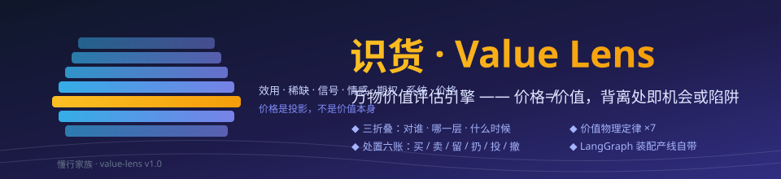
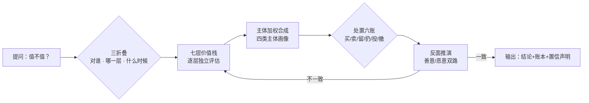

# 识货 · Value Lens

OpenSquilla Skill：万物价值评估引擎（v1.0.0）

对任何"人 / 事 / 物"回答三个问题：**它值多少、对谁值、现在该怎么处置**（买 / 卖 / 留 / 扔 / 投 / 撤）。核心立场一句话：**价格≠价值**——价格是市场此刻的共识成交点，价值是你逐层评估后的加权结论；两者背离的地方，要么是机会（市场错杀），要么是陷阱（你被叙事抬了价）。



## 徽章

[](SKILL.md) [](LICENSE) [](#-安装opensquilla) [](SKILL.md) [](#%EF%B8%8F-文档装配产线langgraph--回溯机制) 

## 流程



## 核心设计

### 七层价值栈（逐层评估，禁止混层）

| 层 | 问题 | 关键提醒 |
|---|---|---|
| 效用 | 解决什么问题？替代品多不多？ | 价值的底座 |
| 稀缺 | 供给是否刚性？ | **人为稀缺**（限量/联名）按营销成本打折 |
| 信号 | 向别人传递什么？ | 换个圈子可能清零甚至变负 |
| 情感 | 纪念与喜爱 | **只对持有者生效**，市场一分钱不认 |
| 期权 | 未来的可能性 | 最容易被讲故事放大：先要概率、再要退出路径 |
| 系统 | 与你生态的协同价值 | "留"的最大来源，单件视角最容易漏掉 |
| 价格 | 此刻的成交数字 | 前六层的投影，不是价值本身 |

### 价值物理定律（不随行情变化）

半衰期定律 · 处置不等式 · 沉没成本隔离 · 禀赋效应（空手重买测试）· 共识警惕 · 人为稀缺识别 · 峰终定律

### 处置六账（买卖决策主输出）

买入账 / 持有账 / 留用账 / 卖出账 / 扔弃账 / 机会账——结论只允许六种：**买 / 卖 / 留 / 扔 / 投 / 撤**，每条附触发条件。

### 对"人和事"的边界

七层栈同样适用于评估人与事（合租、合伙、承诺、机会），但铁律升级：**不做道德审判、不给人格定性、不预测具体行为**，边界提示强制输出。

## ⚙️ 文档装配产线（LangGraph + 回溯机制）

SKILL.md 不是一次性写成的：分节草稿（`drafts/`）→ 逐节校验（`sections.json` 规格）→ 失败节**定点回溯**（不整篇重写，好节原封不动）→ 全绿组装 → 终检写盘。跨次运行通过 `state.json` 记录尝试预算（3 次/节），超限告警"换方法而非重试"。设计与实测记录见 [DESIGN.md](DESIGN.md)。

```bash
pip install langgraph
python doc_pipeline.py .            # 校验+组装，或输出定点修复报告
python doc_pipeline.py . --reset    # 清空尝试历史
```

本仓库产线是自包含的通用引擎：任何长文档目录，建一份 `sections.json`（章节/最小长度/必需元素）+ `drafts/` 即可上产线。

## 文件

| 文件 | 说明 |
|---|---|
| `SKILL.md` | 方法论主文件（产线产物）|
| `sections.json` | 产线规格（10 节标题 / 最小长度 / 必需元素）|
| `drafts/` | 各节草稿，修改后重跑产线即可 |
| `doc_pipeline.py` | LangGraph 装配产线（自包含通用版）|
| `DESIGN.md` | 产线设计说明：图结构 / 回溯机制 / 实测记录 |
| `assets/banner.svg` | 详情页横幅 |
| `LICENSE` | MIT |

## 📦 安装（OpenSquilla）

```bash
cd <你的工作区>/skills
git clone https://github.com/makefeier/value-lens.git
```

然后对助手说任意一句即可触发：

> 这东西值不值 / 该不该卖 / 值多少钱 / 帮我断舍离

## Roadmap

- 领域插件（每个 = 本引擎 + 专属行情源）：实体资产 / 收藏品 / 知识技能 / 时间注意力 / 承诺关系
- 系列整合：与 [phone-buying-guide](https://github.com/makefeier/phone-buying-guide)、[insider-compass](https://github.com/makefeier/insider-compass)、[jargon-buster](https://github.com/makefeier/jargon-buster) 互为姊妹项目

## License

MIT
